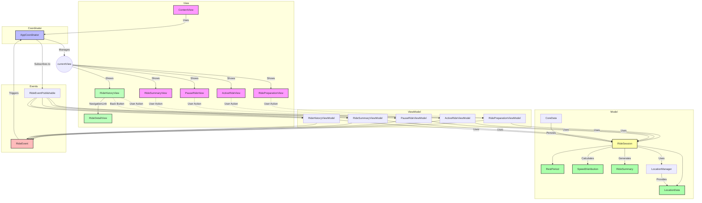

# PacePal - 나만의 페이스 메이커 

  

  

## 🚴‍♂️ App Statement 
**자전가 라이딩을 즐기는 사용자에게 현재 속도를 명확히 보여줘 화면을 자주 보지 않아도 원하는 페이스를 유지할 수 있도록 도와주자.**

## 📱 앱 소개 
<table style="width: 100%; table-layout: fixed;">
  <tr>
    <td style="text-align: center;">
      
    </td>
    <td style="text-align: center;">
      
    </td>
    <td style="text-align: center;">
      
    </td>
    <td style="text-align: center;">
      
    </td>
    <td style="text-align: center;">
      
    </td>
  </tr>
</table>

## 🎨 Project Architecture 

## 🧩 Team 
<table style="width: 100%; table-layout: fixed;">
  <tr>
    <td style="text-align: center; padding: 10px;">
      <h3>김리</h3>
    </td>
    <td style="text-align: center; padding: 10px;">
      <h3>마리</h3>
    </td>
    <td style="text-align: center; padding: 10px;">
      <h3>제이비</h3>
    </td>
    <td style="text-align: center; padding: 10px;">
      <h3>파인</h3>
    </td>
  </tr>
  <tr>
    <td style="text-align: center; padding: 10px;">
      
    </td>
    <td style="text-align: center; padding: 10px;">
      
    </td>
    <td style="text-align: center; padding: 10px;">
      
    </td>
    <td style="text-align: center; padding: 10px;">
      
    </td>
  </tr>
</table>

## 🐈‍⬛ Github Convention

### 이슈 종류

| 이슈 종류        | 설명                                                                                         |
|------------------|----------------------------------------------------------------------------------------------|
| `feat`     | **Feature**: 새로운 기능을 추가하거나 구현할 때 사용하는 이슈입니다. 예: 다크 모드 지원 추가.               |
| `bug`          | **Bug**: 예상과 다른 동작이나 코드 오류를 해결할 때 사용하는 이슈입니다. 예: 로그인 화면에서 앱 충돌.   |
| `enh`  | **Enhancement** 기존 기능을 개선하거나 확장할 때 사용하는 이슈입니다. 예: List 컴포넌트의 성능 최적화.         |
| `ref`   | **Refactor**: 기능을 변경하지 않고 코드 구조를 개선할 때 사용하는 이슈입니다. 예: 상태 관리를 ViewModel로 분리.|
| `chore`    | **Chore**: 유지보수 작업이나 설정 업데이트 같은 비기능적 작업에 사용하는 이슈입니다. 예: Xcode 프로젝트 설정 업데이트. |
| `doc`| **Documentation**: 문서화 작업이 필요할 때 사용하는 이슈입니다. 예: 새로운 기능에 대한 사용자 가이드 업데이트.    |

### 이슈 제목 ➡️ `[이슈 종류] 이슈 이름` 
ex) `[feat] 로그인 기능 추가`

### 브랜치 이름 ➡️ `이슈종류/#이슈 번호/적업할내용`
ex) `feat/#3-Login`

### 커밋 이름 ➡️ `이슈종류/#이슈 번호 - 작업내용`  
ex) `feat/#3-로그인 버튼 추가` 

### 풀리퀘스트 이름 ➡️ `[이슈종류] 작업내용`
ex) `[feat] 로그인 기능 완료`
